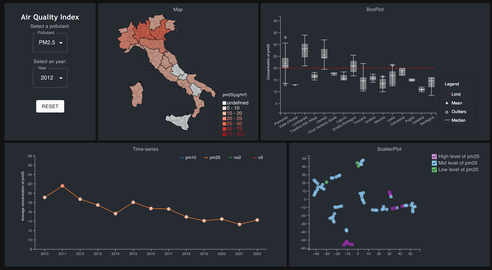

# VisualAnalytics Tool for Air Quality Index
Project for Visual Analytics course (2023/24) at Sapienza University of Rome.

## Overview
Air Quality Index Visual-Analytics
tool analyze concentration of pollutants in Italy
in order to improve public awareness and assess
the impact of environmental policies. The tool of-
fers an interactive map, time-series, scatter-plot
and box-plot to identify patterns. Users can inter-
act with the tool to explore insights such as region
with higher concentration of some pollutant, or to
capture an overview of the last 10 years about the
situation of Italy.

## Prerequisites

Before you begin, make sure you have the following prerequisites in place:

NodeJS: The frontend node of our application is completely based on a NodeJS development server; therefore, if you don't have the last version of NodeJS installed, you can download it from the official website, based on your operating system.

## Installation and Launch

For installing and launching the application, make sure you execute the following procedure:

1. Open a terminal or a command prompt;
2. Navigate to the folder in which you want to clone the repository;
3. Clone the GitHub repository:
`git clone https://github.com/db1858927/VisualAnalytics.git`
5. Navigate to the VisualAnalytics folder from the terminal;
6. For launching the application:
  7. Navigate to the va-project folder from the terminal:
  8. Only if it is your first launch, execute the following command:
  `npm install`
9. Execute the following command:
     `npm start`

Windows users only can alternatively execute the following procedure:

1. Open a terminal or a command prompt;
2. Navigate to the folder in which you want to clone the repository;
3. Clone the GitHub repository:
`git clone https://github.com/db1858927/VisualAnalytics.git`
4. Open the VisualAnalytics folder;
5. Execute the run.bat batch script.
